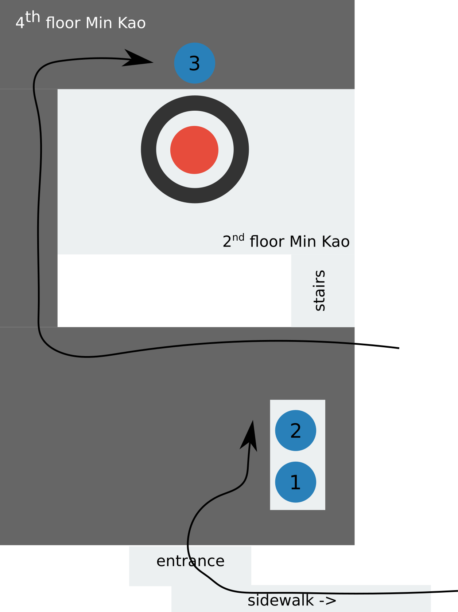
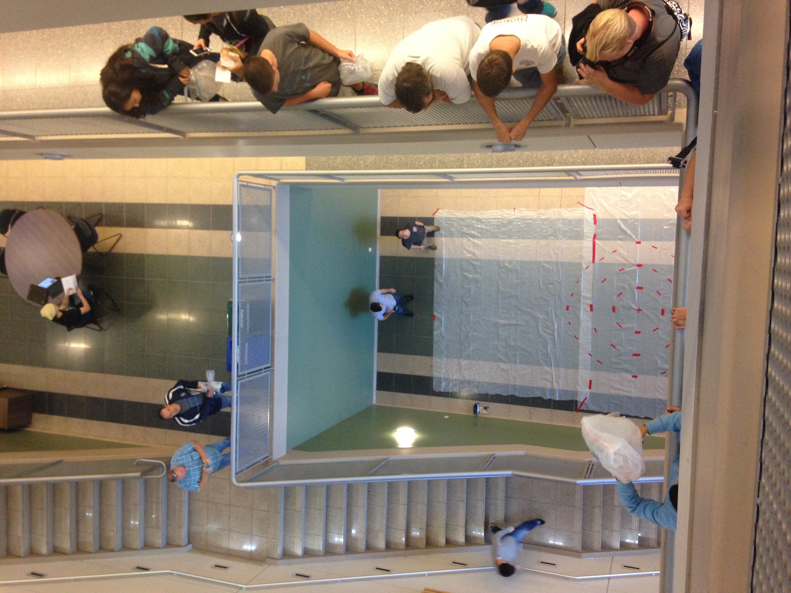

This is a guide on everything you need to run the competition. If it
is not detailed enough add it!

# Schedule

 - (1-2 months prior) MRS will get an email sometime August-September asking to verify that MRS is indeed running the Egg Drop
   - will need to email back Tau Beta Pi and `Gale, Martha" <mgale1@utk.edu>`
 - (1-2 months prior) Send rules to martha gale for egg drop competition `competition_rules.pdf`
 - (1-2 months prior) Request 1 table and 4 chairs for the egg drop event again contact martha gale
 - (1-2 months prior) Announce and get volunteers for egg drop at MRS meeting preferably
   1-2 months in advance. Shows pictures of event it is always a success.
 - (1 day before) buy supplies eggs, tape, and tarp day before the event (about $100 MRS will reimburse you)
 - arrive to egg drop about 1 hour before to setup the
   competition. See competition setup for detailed
   instructions. competition usually goes from 10:30-12. So make sure
   to start setup at about 9 am-9:30am.

# Competition Setup

Will refer to locations by label (1, 2, 3) and dropzone which is the
target on the 2nd floor. One thing to clarify is that the dropzone is
about 30 feet below on floor 2 while the rest of the competition is on
the 4th floor.

1. (needs 2 people) Get reserved 1 table and 4 chairs from perkins (ferris entrance side).
2. Setup table and three chairs on location (1,2)
3. Setup 1 chair on location (3)
4. put all eggs (cartons) on location (3)
5. (needs 2 people) move all tables, sidetables, chairs, and sofa in
   the dropzone area. you will notice there is a doorway in the corner
   of the dropzone opposite from the staircase. inside this doorway you
   should store all the furniture.
6. Setup the dropzone by putting up the tarp directly below the
   dropzone on location (2) make sure that you cover as much of the
   floor as possible.
7. Use duck tape to make a dropzone target that looks like image
   below. You do whatever you like just make sure that there are 3
   rings each with a radius 2 feet more than the other.
8. Put face shield and paper towels in dropzone for volunteer is he/she chooses to use
   it.
9. Put weight scale, forms, and pens on table.

# Competition Cleanup

1. Cleanup dropzone and throw away tarp
2. (needs 2 people) Return tables and chairs to perkins
3. Return face shield and scale to MRS office

# Equipment

 - face shield (located in MRS office)
 - food scale (located in MRS office)
 - 5 pens for students filling out forms
 - ~150 signup forms `student_signup.pdf` (make sure to update date and QR code to google sheets document)
 - google sheets document of contraption scores (a template for the document is provided `scores.xls`)

**buy** about $100 total
 - 1 role ducktape
 - 1 disposable tarp needs to cover 20ft x 20ft area
 - a lot of paper towels to wipe up egg yokes
 - ~150 eggs cage free free range eggs (yes they are more expensive)

# Roles

Below are listed the bare minimum number of roles (5) but running the
competition will be stressful if you have less than 6 people. You will
want to aim for **10 volunteers**. Seriously the more the better. It is
easier for everyone.

## General - (Photographer/Questions/Forms)

The more people (2-3) with this role the better.

Make sure that students are forming the two lines show in the layout
picture above. The first line should end at the table and go outside
of the min kao building along the sidewalk. Make sure that the
students are only taking up one side of the entrance (we have had
complaints before). the second line should end at the egg drop station
and wrap around the railing single file (so that people can still pass
by) see figure above for path.

This is a role that is a mix because each role in its self does not
take all your time. Your role is to hand out forms to students in line
for the part counting and part weighing so that they can start filling
out the form before getting to the table. Additionally please help
answer any questions that people will have. Also please take pictures
of the event so that MRS has something to show!

# Form Score Updater

This will require a person 30 minutes after the competition starts and
onwards.  The score updating is the person who will take completed
contraption forms and add the information to the excel spreadsheet
(hopefully google doc so it can be realtime for the students). All
completed contraption sheets will be returned to the table where parts
are weighed and counted if the student want to be scored.

## Part Counter

The part counter will count the number of parts each students
contraption contains. A general rule of thumb is be nice and be
consistent. Any contraption with more than 4 parts is pretty much
guaranteed to lose the competition. For example count 5 pieces of tape
as one, count 8 straws as 1 or 2 straws. You will be the first table
to students go to. You will inevitably have to tell students to fill
out a form but hopefully the question/form people can help!

## Part Weigher

The part weigher uses the scale to weight contraptions in grams. Make
sure to tare the scale. You will be at the same table as the
part counter.

## Drop Zone Inspector (Egg Inspector)

This person is responsible for being at the dropzone and opening up
contraptions to check if the egg cracked. You must also ensure that
the dropzone is safe and that no students walk underneeth the
dropzone. This is the messiest job but is also a lot of fun.

## Drop Zone Conductor

Typically the role that will require two people because you will have
several responsibilities. You are the person responsible for:

 - ensuring that each contraption has an egg before dropping
 - telling the student when it is safe to drop the contraption
 - filling out their contraption form with (survived and drop zone)

 This role works best with one person ensuring that each person's
 contraption in line has an egg.
